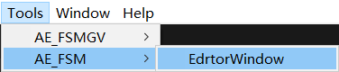

# 可视化状态机

使用指南

1.创建自己的FSMController

例如Test中的`MYFSMController.cs`

其中的泛型为状态机拥有者,如`Test`

```c#
using AE_FSM;

public class MYFSMController : FSMController<Test>
{

}
```

2.创建状态机文件

在右键菜单AE_FSM/FSMController


3.创建状态脚本

创建继承`IFSMState`的脚本

```c#
using AE_FSM;
using UnityEngine;

public class Attack : IFSMState
{
    public void Enter(FSMController controller)
    {
    }
    public void Update(FSMController controller)
    {
       
    }
    public void LaterUpdate(FSMController controller)
    {
    }
    public void FixUpdate(FSMController controller)
    {
    }
    public void Exit(FSMController controller)
    {
    }
}
```

4.最后使用可视化状态机愉快的编写吧!

将``MYFSMController.cs``挂载到游戏对象上点击,点击一下菜单



打开状态机窗口,点击状态机文件或者挂载状态机的对象,最后将状态脚本拖入窗口中

